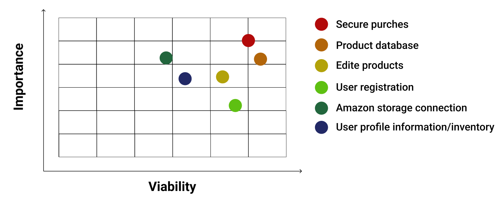
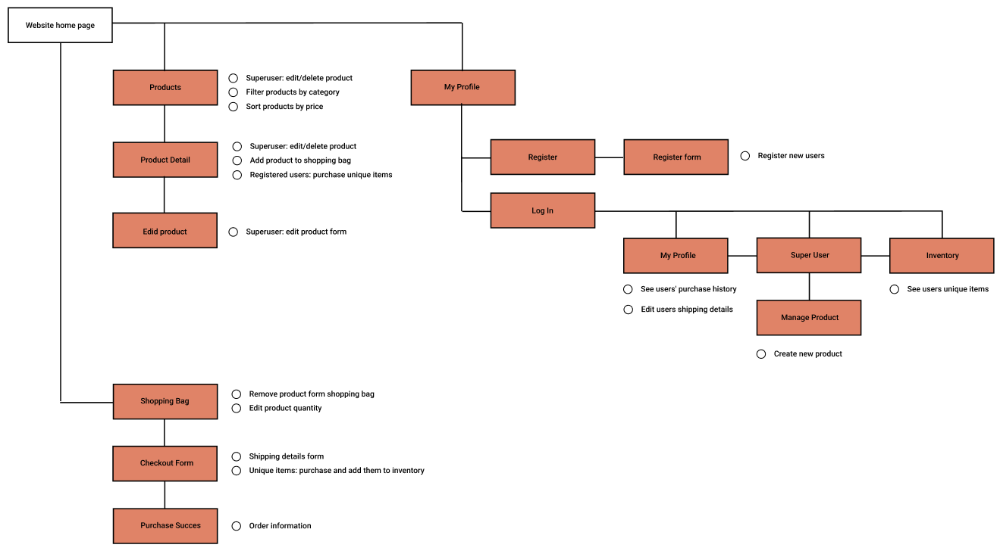

<h1 align="center">
  THE GYM
</h1>
  

  Find and buy product for your fitness life.

[View the live project here](https://miles-stone-project-4-the-gym.herokuapp.com/ "Link to Live project")

## Table of contents
1. [UX](#UX)
    1. [Project Goals](#Project-Goals)
    2. [User Stories](#User-Stories)
    3. [Development Planes](#Development-Planes)
2. [Features](#Features)
3. [Issues and Bugs](#Issues-and-Bugs)
4. [Admin User Information](#Admin-User-Information)
4. [Technologies Used](#Technologies-Used)
     1. [Main Languages Used](#Main-Languages-Used)
     2. [Frameworks, Libraries & Programs Used](#Frameworks-Libraries-&-Programs-Used)
5. [Testing](#Testing) ☞ **[Testing.md](TESTING.md)**
6. [Deployment](#Deployment)
7. [Credits](#Credits)
***

***

## UX 
### Project Goals
This website was designed for a fictional fitness market place, "Muscle Gym". The purpose of this website was to establish an online presents for people to buy products and workout plans.

This is the final Milestone Project from necessary for the project to complete the Full Stack Web Development Program at The Code Institute.

The main requirement was to make a website using **HTML**, **CSS**, **JavaScript**, **Python+Django**.

#### User Goals
The user is looking for:
- Products to improve their fitness levels.
- Workout plans to improve their fitness levels.
- Share opinions and tips about products and workout plans.
- A place where could easily access workout plans.
- Place to see my order history.
- Secure way to purchase products from the website.

#### Developer Goals
The Developer is looking to:
- Create a web page for user to share recipes.
- Create a web page for owner to upload products.
- Demonstrate their skills in software development, using newly learned languages and libraries.
- Deploy a project on their portfolio.

### User Stories
#### New/Potential clients:
1. As a new customer, I want to easily navigate through the website to find the relevant content, effortlessly.
2. As a new customer, I want to see all products I can purchase on the website.
3. As a new customer, I want to be able to buy an item without registering.
4. As a new customer, I want to be able to register to the website.
5. As a new customer, I want to be able to search for desired items on the website.

#### Current Clients Goals:
1. As a current client, I want to be able change my shipping information.
2. As a current client, I want to be able to find all my purchase history of products.
3. As a current client, I want to be able access my unique item inventory.
4. As a current client, I want to share my opinion on the website products.

#### Owner Goals:
1. As an owner, I want to be able to add new products.
2. As an owner, I want to be able to edit existing products.
3. As an owner, I want to be able to delete items.

### Development Planes

In order to create a comprehensive and informative website, the developer gathered information from social forums to add required functionality to the site and how would it answer user stories, as described above.

<strong>1. <u>Strategy</u></strong>

Broken into two categories, the website will focus on the following target audiences:
- **Roles:**
     - New users
     - Current users
     - Owner

- **Demographic:**
     - 16 and plus year olds
     - People interested in fitness

The website needs to enable the **user** to:
     - All users: What products does the website sell
     - All users: Any product details
     - Registered user: all order history
     - Registered user: any single purchase history

The website needs to enable the **Shop** to:
- Develop an online presence 

With these goals in mind, a strategy table was created:

<strong>2. <u>Scope</u></strong>

A scope was defined to clearly identify what needed to be done to align features with the strategy:
- **Content Requirements**
     - The user will be looking for:
          - Easy to find products
          - See their own purchase history
          - See their own unique item inventory
          
- **Functionality Requirements**
     - The user will be able to:
          - Be able to register to web page easily
          - Easily find wanted products
          - Easily navigate through the pages
          - Edit there shipping information
          - Edit/Delete products (for admin)
          - Create new products (for admin)

<strong>3. <u>Structure</u></strong>

The web page content is divided through multiple pages in a tree like pattern for easy navigating and distinguishing content. The **hierarchial tree structure**:

<strong>4. <u>Skeleton</u></strong>

Wireframe mockups were created in a [Figma Workspace](https://www.figma.com/file/rdJw2ceG1dKdHpPGlHHl01/Home-Page?node-id=0%3A1)

[Back to top ⇧](#table-of-contents)

## Features

**Main Navigation Bar**
    <dd>
        <ul>
            <li>
                <strong>Logo</strong> - Logo on hover is framed in borders. On clicking user is redirected to the home page.
            </li>
            <li>
                <strong>Navigation lins</strong> - Two navigation links: "Home" and "Products". Home redirects user to the home page. Products redirects users to the product page.
            </li>
            <li>
                <strong>My Account</strong> - After clicking the icon a drop down apears with user navigations:
                <ul>
                    <li>
                        Non registered users:
                            Register: redirects user to register form.
                            Login: redirects user to log in page.
                    </li>
                    <li>
                        Registered user:
                            My profile: redirects user to my profile page.
                            Inventory: redirects user to inventory page.
                            Logout: redirects user to logout page.
                    </li>
                    <li>
                        Admin user:
                            All of the above
                            Manage product: redirects user to add product form.
                    </li>
                </ul>
            </li>
            <li>
                <strong>Shopping bag Icon</strong> After clicking the shopping bag icon user is redirected to the shopping bag page. Is there are any items in the shopping under the shopping bag icon the total price is shown and the icon color changes to white.
            </li>
            <li>
                <strong>Search</strong> Search bar allows user to search for any product true the website.
            </li>
        </ul>
    </dd>

**Home Page**
    <dd>
        <ul>
            <li>
                <strong>Register Button</strong> Non registered users to click are redirected to register form page. Registered users are redirected to the product page.
            </li>
        </ul>
    </dd>

**Products Page**
    <dd>
        <ul>
            <li>
                <strong>Product Categories</strong> On top of the page is places a category list bar. After clicking any of the items, products will be filtered to show only that category. 
            </li>
            <li>
                <strong>Sort Bar Button</strong> Sort Bar Button sits on the left side of the screen. After clicking the icon an sorting option box appears to sort items by price, ascending or descending.
            </li>
             <li>
                <strong>Back to Top</strong> Back to top button is placed at the bottom right corner of the screen so the user can easily return to the top of the page.
            </li>
            <li>
                <strong>Product Cards</strong> A card element is created for every product. The card contains product image, product category if it has one, product price, name and info button which redirects user to the product details page. Admin tools to edit or delete product appears only if supper user is connected.
            </li>
        </ul>
    </dd>

**Product Details Page**
     <dd>
          Products page contains of product image witch is placed on the left side of the screen. Products' name witch is placed on top of the page. Product price. Products' category. Quantity appear only for non unique items, so the user can choose how many items can be added to their shopping bag. Add to bag button will add selected item to the shopping bag and a success message will appear with a brief information what is in the shopping bag. Keep shopping button will retur user to the products page. Admin tools to edit or delete product appears only if supper user is connected.
     </dd>

**Shopping Bag**
    <dd>
        <ul>
            <li>
                <strong>Page Layout</strong> Page consists of page title, which is at the top of the page. For every item in the shopping a row is generated with consist of product image, product quantity, product information, product price and product price times quantity. At the bottom of the page user can see total price, shipping costs' ant grant total of the order. At the top of the page there is a button to return to products page. At the bottom of the page there is a button to go to a checkout form page. 
            </li>
            <li>
                <strong>Quantyti</strong> Quantities can be adjusted at the shopping bag page page, entering a different number.
            </li>
             <li>
                <strong>Remuve</strong> Any item can be removed from the shopping bag page by clicking remove button.
            </li>
        </ul>
    </dd>

**Checkout**
     <dd>
          On top of the page there is a checkout page title. Page is divided by half: left side is for user information for shipping details, right side is a quick summer of the items to be processed. At the bottom of the page are two buttons: just bag and complete order. August bag returns the user to the shopping bag page and complete order redirects user to order success page.
     </dd>

**Product Management**
     <dd>
          Product management holds a form witch after filled up will add or edit a product. The form consists of product category, sku, product name, description, has or not a size (for cloths), image url, select image button, and unique check box. To button at the end of the form: cancel, which will cancel the product management, and add product, or edit product witch will complete the product management and will redirect user to the product detail page.
     </dd>

**My Profile**
     <dd>
          My profile page consists of user default shipping information witch after filling up will save any changes to user shipping information. On the right side of the screen there is a complete summary of the user purchase history. Clicking on any order item will redirect the user so success purchase pages with all the shipping and charging information.
     </dd>

**Inventory**
     <dd>
          At inventory page user can see their unique item inventory. These items are information based so having more than one unnecessary. Page title is at the top of the page. For every item a card is created. Card consist of product image, category, purchase date and name. Clicking on the card image user is redirected to purchase success page.
     </dd>

**Comunyt**
     <dd>
          Community page allows registered users to leave messages for every website visitor. The page has a message button at the top of the page which is seen only by registered users. At the left bottom corner there is a return to top button which allows users to scroll back to the top of the page.
     </dd>

[Back to top ⇧](#table-of-contents)

## Admin User Information

**GitHub**
     <dd>
          Username - Admin
          Password - Silorak1990 (key sensitive)
     </dd>
**Heroku**
     <dd>
          Username - Admin
          Password - silorak1990 (key sensitive)
     </dd>

## Issues and Bugs 
The developer ran into a number of issues during the development of the game, with the noteworthy ones listed below, along with solutions.

**User  reciving two orders per one purches**
- When user completed a purchase he would receive two orders. Two functions where named the same witch cast the bug. Simply after change one function the bug was fixed.

**No item info in inventory**
- Inventory items would not be populated with the specific item's information only order information would appear. After careful examination the bug was that wrong name attribute was used. Instead of using the unique item name "listitem_unique", a "listitem" was used. Changing the name fixed the bug.

**No info on succes purches**
- The success purchase page information would not be populated with product information, only order information would be populate. This occurred because no purchase item information was past on to the view. Specifically sending information to the function and passing it to view fixed the bug.

**Heroku app not uploading page**
- Herroku would not upload the page because of 500 errors. After attempting to push the code herroku would not upload the page. Git push would be successful. After checking multiple possible causes, found the problem. One of the email values was misspelled and herroku could not get the correct value. After changing the name bug was fixed.

**Checkout would not complit**
- After filling in the form and pressing complete order button, the checkout function would not work. The error was that the url gets an unexpected value, "}". After carefully looking true the code there was an extra} witch cast the bug. Removing the } bug was fixed.

**Product data not showing**
- After ordering unique item product data not showing in checkout_unique page. At function checkout unique item variable was assigned later in the code and change to order information not product information. After the remaining item in the product information bug was fixed.

[Back to top ⇧](#table-of-contents)

## Technologies Used
### Main Languages Used
- [HTML5](https://en.wikipedia.org/wiki/HTML5 "Link to HTML Wiki")
- [CSS3](https://en.wikipedia.org/wiki/Cascading_Style_Sheets "Link to CSS Wiki")
- [JavaScript](https://en.wikipedia.org/wiki/JavaScript "Link to JavaScript Wiki")
- [Python](https://en.wikipedia.org/wiki/Python_(programming_language) "Link to Python Wiki")

### Frameworks, Libraries & Programs Used
- [Bootstrap](https://getbootstrap.com/ "Link to Boootstrap page")
     - Materialize was used to implement the responsiveness of the site, using materialize classes.
- [jQuery](https://jquery.com/download/ "Link to jQuery page")
     - jQuery was used to simplify the JavaScript code used.
- [Django](https://www.djangoproject.com/ "Link to Django page")
     - Django was used to siplify the project build up.
- [Google Fonts](https://fonts.google.com/ "Link to Google Fonts")
    - Google fonts was used to import the fonts "Open Sans" and "Lobster".
- [Font Awesome](https://fontawesome.com/ "Link to FontAwesome")
     - Font Awesome was used for graphical indication of features buttons.
- [Git](https://git-scm.com/ "Link to Git homepage")
     - Git was used for version control by utilizing the GitPod terminal to commit to Git and push to GitHub.
- [GitHub](https://github.com/ "Link to GitHub")
     - GitHub was used to store the project after pushing.
- [jQuery Validation](https://jqueryvalidation.org/ "Link to jQuery Validation page")
     - jQuery Validation was used to simplify form validation for the **Feedback Form**.
- [Am I Responsive?](http://ami.responsivedesign.is/# "Link to Am I Responsive Homepage")
     - Am I Responsive was used in order to validate the responsiveness of the design.

[Back to top ⇧](#table-of-contents)

## Testing

Testing information can be found in a separate testing file [TESTING.md](TESTING.md) Prideti testing fila

## Deployment

This project was developed using [Visual GitHub](https://github.com/ "Link to GitHub site").

### Deploying on Heroku Pages
To deploy this page to Heroku Pages from GitHub repository, the following steps were taken:

**Enabling GitHub integration**

1. You can configure GitHub integration in the Deploy tab of apps in the [Heroku Dashboard](https://dashboard.heroku.com/apps "Link to Herocku Dashboaard").

2. To configure GitHub integration, you have to authenticate with GitHub. You only have to do this once per Heroku account.

3. After you link your Heroku app to a GitHub repo, you can selectively deploy from branches or configure auto-deploys.

**Automatic deploys**

1. When you enable automatic deploys for a GitHub branch, Heroku builds and deploys all pushes to that branch. If, for example, you have a development app on Heroku, you can configure pushes to your GitHub development branch to be automatically built and deployed to that app.

2. If you’ve configured your GitHub repo to use automated Continuous Integration (with Travis CI, for example), you can check the “Wait for CI to pass before deploy” checkbox. When enabled, Heroku will only auto-deploy after all the commit statuses of the relevant commit show success.
This commit won’t auto-deploy because one of the checks shows a pending status.

3. This commit will auto-deploy because all of the checks show a status of success.

**Review apps**

With review apps enabled for a Heroku app, Heroku will create temporary test apps for each pull request that’s opened on the GitHub repo that’s connected to the parent app. Review apps are great if you’re using GitHub Flow to propose, discuss, and merge changes to your code base. Because pull request branches are deployed to new apps on Heroku, it’s very simple for you and your collaborators to test and debug code branches. You can also run automated integration tests on the Heroku app representing a GitHub branch.

See the [Review apps article](https://devcenter.heroku.com/articles/github-integration-review-apps "Link for app article") for details.

**Heroku CI**

Once you’ve connected your GitHub repo to your Pipeline, you can turn on [Heroku CI](https://devcenter.heroku.com/articles/heroku-ci "Link to Heroku CI"), our visual, low-configuration test runner that integrates easily with Heroku Pipelines (and so complements Review apps, existing Heroku apps, and our GitHub integrations). Any Heroku Pipeline is already Heroku CI ready – just turn it on in the Pipeline’s Settings tab.

**Links to diffs**

For apps that are linked to GitHub repos, releases in the Dashboard Activity tab will include a “View Diff” link. Following the link will take you to the GitHub comparison view, showing the changes made since the last release.

**Disconnecting from GitHub**

Individual apps can be disconnected in the GitHub pane of the Deploy tab for the app.

[Back to top ⇧](#table-of-contents)

## Credits 

### Images and Recipes
All images were uploaded from [Pexels](https://www.pexels.com/ "Link to Pexels page")

All image author names are at the user image file names.

### Code 
The developer consulted multiple sites in order to better understand the code they were trying to implement. For code that was copied and edited, the developer made sure to reference this within the code. The following sites were used on a more regular basis:
- [Stack Overflow](https://stackoverflow.com/ "Link to Stack Overflow page")
- [W3Schools](https://www.w3schools.com/ "Link to W3Schools page")
- [Bootstrap](https://getbootstrap.com/ "Link to BootStrap page")
- [Code Institute Ejucation Material](https://codeinstitute.net/global/ "Link to Coudinary page")

[Back to top ⇧](#table-of-contents)
