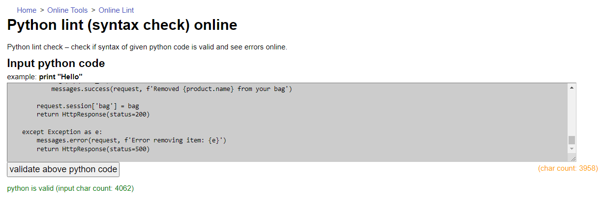

<h1 align="center">
  The Gym
</h1>

<h1 align="center"> Testing </h1>

[Main README.md file](README.md "Link to README file")

[View live project](https://miles-stone-project-4-the-gym.herokuapp.com/ "Link to Live project")

[View website in GitHub Pages](https://github.com/PerkunasKF/CI-MSP4-Gym_1.0 "Link to Blank! Repository")

***
## Table of contents
1. [Testing User Stories](#Testing-User-Stories)
2. [Manual Testing](#Manual-Testing)
3. [Automated Testing](#Automated-Testing) 
     - [Code Validation](#Code-Validation)
     - [Lighthouse Auditing](#Lighthouse-Auditing)
4. [User Testing](#User-Testing)

***

***
## Testing User Stories

#### User Goals:
1. As a user I am looking for products to improve their fitness levels.
    - After just entering the website user sees on the navigation bar products page.
    - The product page shows the entire catalog of all products available for purchase.
    - Cliking on any product will redirect the user to product details page to get more information about the product.
2. As a user I am looking for workout plans to improve their fitness levels.
    - After entering the website user sees page title that says for new registered users a workout plan is free.
    - After entering the website user sees a navigation link on the main navigation bar which redirects user to the product page.
    - The product page has a product filter feature that allows selecting to show only workout plans.
    - Clicking on any of the workout plan will allow users to get more details about the workout plan.
3. As a user I am looking to share opinions and tips about products and workout plans.
    - After entering the website user sees a community link on the main navigation bar. After clicking the link users is redirected to the community page.
    - Community page features messages which are left by any registered user of the webpage.
4. As a user I am looking for a place where could easily access workout plans.
    - After registering and purchasing a workout plan for the user an inventory page is created. The page shows all both workout plans.
5. As a user I am looking for a place to see my order history.
    - After registering for the user a profile page is created.
    - Clicking my account link will open a drop-down box with the link my profile witch will redirect user to their profile page.
    - On user profile page user can change their shipping information for easier purchase later on.
    - On the right side of the screen users can see all their purchase history.
    - Clicking on any purchase history item will redirect user to a new page which will show their order information.
6. As a user I am looking for secure way to purchase products from the website.
    - After the user fills select an item to buy their shopping bag is populated with items they want to buy.
    - Clicking on the shopping cart icon user is redirected to there session shopping bag.
    - Clicking on the secure checkout on the shopping bag page will redirect the user to the checkout form.
    - Checkout form is already filled up if the user made a purchase before and is registered, or if he failed up shipping information on their profile page.
    - Secure payment is ensured using Stripe tools.
    - Red using the Chand on failing to ship product to the user webhook feathers are used.

[Back to top ⇧](#table-of-contents)

## Manual Testing

### Code Validation

#### [W3C Markup Validator](https://validator.w3.org/ "Link to W3C Markup Validator") was used to validate the `HTML` code used:

**Result:**

Home page

Product page

Product details

Shopping Bag

Checkout

Comunity

Edit product

My profile

Inventory

#### [W3C CSS Validator](https://jigsaw.w3.org/css-validator/ "Link to W3C CSS Validator") was used to validate the `CSS` code used:

**Result:**

Base

Checkout Unique

#### [JSHint](https://jshint.com/ "Link to JSHint") was used to validate the `JavaScript` and `JQuery` code used:

**Results:**

- The warrning for `stripe_elements.js` :

    
    - Add file .jshintrc for the solution
    - Stripe variable is from a cloudinary code template

#### [ExtendsClass](https://infoheap.com/python-lint-online/ "Link to ExtendsClass") was used to validate the `Python` code used:

**Results:**

- The were no warnings for `checkout/views.py` :

    

- The were no warnings for `checkout/webhook_handler.py` :

    

- The were no warnings for `checkout/webhook.py` :

    

- The were no warnings for `checkout_unique_5/views.py` :

    

- The were no warnings for `checkout_unique_5/webhook_handler.py` :

    

- The were no warnings for `checkout_unique_5/webhooks.py` :

    

- The were no warnings for `comunity/views.py` :

    

- The were no warnings for `products/views.py` :

    

- The were no warnings for `profile/views.py` :

    

- The were no warnings for `shoppingBag/views.py` :

    

- The were no warnings for `user_inventory/views.py` :

    